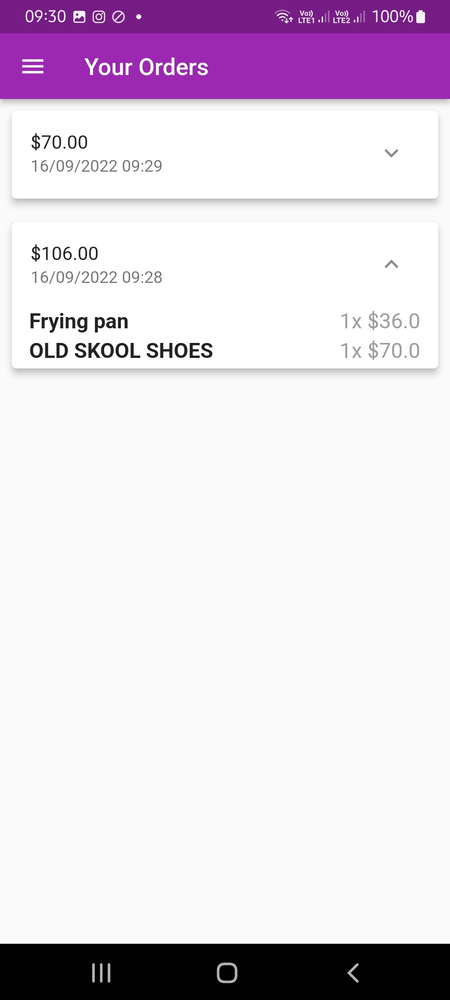

# Great Places App

Hello there!
This is a simple shop app developed in flutter.
In this app each user can create your own products so other users can order it. 
The database was developed using Google Firebase.

This app was developed according to the classes of:

Flutter & Dart - The Complete Guide [2022 Edition] - UDEMY;

### Versions

- **Flutter**: 3.0.5
- **Dart**: 2.17.6

### Setup

Clone it in your machine:
```bash
git clone https://github.com/RodrigoNP3/Simple-Shop-App.git
```

Dependecies:

```bash
dependencies:
  cupertino_icons: ^1.0.2
  provider: ^6.0.3
  intl: ^0.17.0
  http: ^0.13.4
  shared_preferences: ^2.0.15
```

### Navigation

<table>
<thead>
<tr>
<th align="center">Auth Screen Login</th>
<th align="center">Auth Screen SignUp</th>
<th align="center">Main Screen</th>
<th align="center">Main Screen Filter</th>


</tr>
</thead>
<tbody>
<tr>
  
<td align="center">
  <a target="_blank" rel="" href="images/AUTH_LOGIN.jpg">
        

  </a></td>
  
<td align="center">
  <a target="_blank" rel="" href="images/AUTH_SIGNUP.jpg">
        

  </a></td>
  
  
<td align="center">
  <a target="_blank" rel="" href="images/MAIN_SCREEN.jpg">
        

  </a></td>
  
  
<td align="center">
  <a target="_blank" rel="" href="images/MAIN_SCREEN_FILTER.jpg">
        

  </a></td>
  
  
  <table>
<thead>
<tr>

<th align="center">Drawer</th>
  <th align="center">Cart Screen</th>
    <th align="center">Orders Screen</th>
        <th align="center">User Products Screen</th>

</tr>
</thead>
<tbody>
<tr>
  

  
  <td align="center">
  <a target="_blank" rel="" href="images/DRAWER.jpg">
        

  </a></td>
    <td align="center">
  <a target="_blank" rel="" href="images/CART_SCREEN.jpg">
        

  </a></td>
  <td align="center">
  <a target="_blank" rel="" href="images/ORDERS_SCREEN.jpg">
        

  </a></td>
    <td align="center">
  <a target="_blank" rel="" href="images/USER_PRODUCTS_SCREEN.jpg">
        

  </a></td>
  
  <table>
<thead>
<tr>
<th align="center">Add Product Screen</th>


</tr>
</thead>
<tbody>
<tr>
  
<td align="center">
  <a target="_blank" rel="" href="images/ADD_PRODUCT.jpg">
        

  </a></td>
  

  
  

  
  
  
 
  
